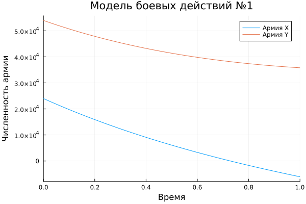
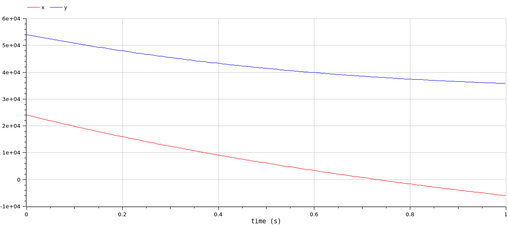
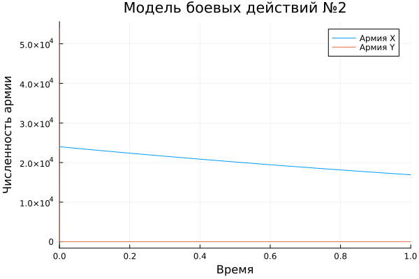
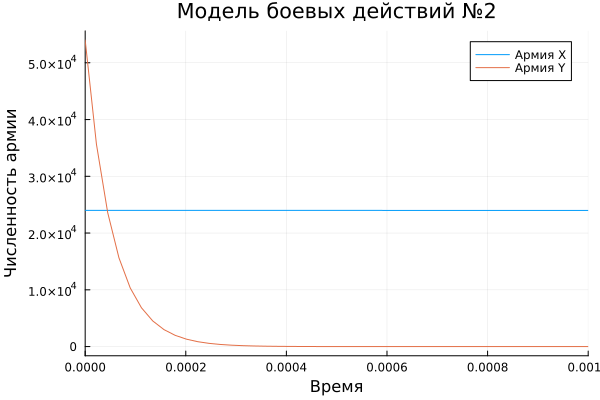
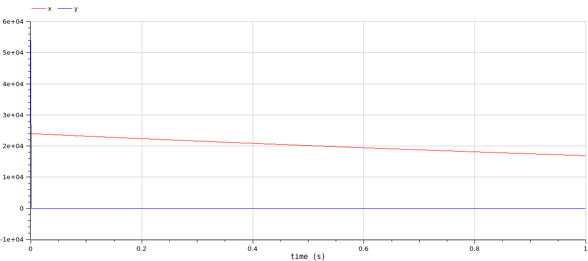
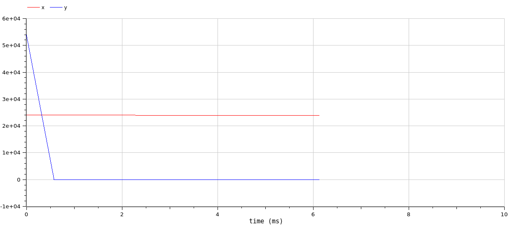

---
## Front matter
lang: ru-RU
title: Лабораторная работа №3
subtitle: Модель боевых действий
author:
  - Алади П. Ч.
institute:
  - Российский университет дружбы народов, Москва, Россия


## i18n babel
babel-lang: russian
babel-otherlangs: english

## Formatting pdf
toc: false
toc-title: Содержание
slide_level: 2
aspectratio: 169
section-titles: true
theme: metropolis
header-includes:
 - \metroset{progressbar=frametitle,sectionpage=progressbar,numbering=fraction}
 - '\makeatletter'
 - '\beamer@ignorenonframefalse'
 - '\makeatother'
---

# Информация

## Докладчик

:::::::::::::: {.columns align=center}
::: {.column width="70%"}

  * Алади Принц Чисом
  * студентк группы Нфибд-01-22
  * Российский университет дружбы народов
  * <https://github.com/pjosh456>

:::
::: {.column width="30%"}

:::
::::::::::::::

# Вводная часть

## Цели 

Построить математическую модель боевых действий и провести анализ.

## Задачи

Между страной $X$ и страной $Y$ идет война. Численность состава войск исчисляется от начала войны, и являются временными функциями $x(t)$ и $y(t)$. В начальный момент времени страна $X$ имеет армию численностью 24 000 человек, а в распоряжении страны $Y$ армия численностью в 54 000 человек. Для упрощения модели считаем, что коэффициенты $a$, $b$, $c$, $h$ постоянны. Также считаем $P(t)$ и $Q(t)$ непрерывные функции.

## Задачи

Построить графики изменения численности войск армии $X$ и армии $Y$ для следующих случаев:

1. Модель боевых действий между регулярными войсками
2. Модель ведение боевых действий с участием регулярных войск и партизанских отрядов 

## Материалы и методы

- Язык программирования `Julia` 
- Библиотеки
	- `OrdinaryDiffEq`
	- `Plots`

# Выполнение лабораторной работы

## Модель боевых действий между регулярными войсками

$$
\begin{cases}
\dfrac{dx}{dt} = -0,4 x(t)- 0,64y(t) + \sin{2t}+2\\
\dfrac{dy}{dt} = -0,77 x(t)- 0,3 y(t) + \cos{t} + 1
\end{cases}
$$

Начальные условия:

$$
\begin{cases}
x_0 = 24000 \\
y_0 = 54000
\end{cases}
$$

## Модель боевых действий между регулярными войсками


```julia
x0 = 24000
y0 = 54000
p1 = [0.4, 0.64, 0.77, 0.3]
tspan = (0,1)
```

## Модель боевых действий между регулярными войсками

```julia
function f1(u,p,t)
	x,y = u
	a,b,c,h = p
	dx = -a*x-b*y + sin(2*t)+2
	dy = -c*x-h*y + cos(t) +1
	return [dx, dy]
end

prob1 = ODEProblem(f1,[x0,y0], tspan,p)

solution1 = solve(prob1, Tsit5())
```


## Модель боевых действий между регулярными войсками

```julia
plot(solution1, title = "Модель боевых действий №1", 
  label = ["Армия X" "Армия Y"], xaxis = "Время", yaxis = "Численность армии")
```

## Модель боевых действий между регулярными войсками

{#fig:001 width=70%}

## Модель боевых действий между регулярными войсками

```
model lab3

Real x(start=24000);
Real y(start=54000);
Real p;
Real q;

parameter Real a=0.4;
parameter Real b=0.64;
parameter Real c=0.77;
parameter Real h=0.3;
```

## Модель боевых действий с участием регулярных войск и партизанских отрядов
```
equation
  der(x) = -a*x-b*y + p;
  der(y) = -c*x-h*y + q;
  p = sin(2*time)+2;
  q = cos(time)+1;

end lab3;
```

## Модель боевых действий между регулярными войсками

{#fig:002 width=70%}

## Модель боевых действий с участием регулярных войск и партизанских отрядов

$$
\begin{cases}
\dfrac{dx}{dt} = -0,35 x(t)- 0,67 y(t) + \sin{2t}+2 \\
\dfrac{dy}{dt} = -0,77 x(t)- 0,45 y(t) + \cos{t} + 1
\end{cases}
$$

## Модель боевых действий с участием регулярных войск и партизанских отрядов

```julia
x0 = 24000
y0 = 54000
p2 = [0.35, 0.67, 0.77, 0.45]
tspan = (0,1)
```

## Модель боевых действий с участием регулярных войск и партизанских отрядов

```julia
function f2(u,p,t)
	x,y = u
	a,b,c,h = p
	dx = -a*x-b*y + sin(2*t)+2
	dy = -c*x*y-h*y + cos(t) +1
	return [dx, dy]
end

prob2 = ODEProblem(f2,[x_0,y_0], tspan,p2)
solution2 = solve(prob2, Tsit5())
```

## Модель боевых действий с участием регулярных войск и партизанских отрядов

```julia
plot(solution2, title = "Модель боевых действий №2", 
  label = ["Армия X" "Армия Y"], xaxis = "Время", yaxis = "Численность армии")
```

## Модель боевых действий с участием регулярных войск и партизанских отрядов

{#fig:003 width=70%}

## Модель боевых действий с участием регулярных войск и партизанских отрядов

```julia
plot(solution2, title = "Модель боевых действий №2", 
  label = ["Армия X" "Армия Y"], xaxis = "Время", yaxis = "Численность армии", 
  xlimit = [0,0.001])
```

## Модель боевых действий с участием регулярных войск и партизанских отрядов

{#fig:004 width=70%}

## Модель боевых действий с участием регулярных войск и партизанских отрядов

```
model lab3

Real x(start=24000);
Real y(start=54000);
Real p;
Real q;

parameter Real a=0.35;
parameter Real b=0.67;
parameter Real c=0.77;
parameter Real h=0.45;
```

## Модель боевых действий с участием регулярных войск и партизанских отрядов

```
equation
  der(x) = -a*x-b*y + p;
  der(y) = -c*x*y-h*y + q;
  p = sin(2*time)+2;
  q = cos(time)+1;

end lab3;
```

## Модель боевых действий с участием регулярных войск и партизанских отрядов

{#fig:005 width=70%}

## Модель боевых действий с участием регулярных войск и партизанских отрядов

{#fig:006 width=70%}

# Выводы

Построили математическую модель боевых действий и провели анализ.

# Список литературы

1. Корепанов В.О., Чхартишвили А.Г., Шумов В.В. Базовые модели боевых действий. УБС, 2023. 354 с.
2. Шумов В.И., Кореапнов В.О. Математические модели боевых и военных действий. Ки&М, 2005. 354 с.

