---
## Front matter
lang: ru-RU
title: Лабораторная работа №4
subtitle: Модель гармонических колебаний
author:
 - Алади П. Ч.
institute:
  - Российский университет дружбы народов, Москва, Россия


## i18n babel
babel-lang: russian
babel-otherlangs: english

## Formatting pdf
toc: false
toc-title: Содержание
slide_level: 2
aspectratio: 169
section-titles: true
theme: metropolis
header-includes:
 - \metroset{progressbar=frametitle,sectionpage=progressbar,numbering=fraction}
 - '\makeatletter'
 - '\beamer@ignorenonframefalse'
 - '\makeatother'
---

# Информация

## Докладчик

:::::::::::::: {.columns align=center}
::: {.column width="70%"}

  * Алади Принц Чисом
  * студент группы НФИбд-01-22
  * Российский университет дружбы народов
  * <https://github.com/pjosh456>

:::
::: {.column width="30%"}


:::
::::::::::::::

# Вводная часть

## Цели 

Исследовать математическую модель гармонического осциллятора.

## Задачи

Постройте фазовый портрет гармонического осциллятора и решение уравнения гармонического осциллятора для следующих случаев

1. Колебания гармонического осциллятора без затуханий и без действий внешней силы $\ddot x + 10x = 0$
2. Колебания гармонического осциллятора c затуханием и без действий внешней силы $\ddot x + 1.5\dot x + 3x = 0$
3. Колебания гармонического осциллятора c затуханием и под действием внешней силы $\ddot x + 0.6\dot x + x = cos(1.5t)$

На интервале $t \in [0; 62]$ (шаг 0.5) с начальными условиями $x_0 = 0.8, \, y_0=-1$ 

## Материалы и методы

- Язык программирования `Julia` 
- Библиотеки
	- `OrdinaryDiffEq`
	- `Plots`

# Выполнение лабораторной работы

## Теоретическое введение

Уравнение свободных колебаний гармонического осциллятора имеет следующий вид:

$$
\ddot x + 2\gamma\dot x + \omega _0^2x = f(t), 
$$

где $x$ – переменная, описывающая состояние системы, $\gamma$ -- параметр, характеризующий потери энергии, $\omega _0$ – собственная частота колебаний, $t$ – время, $f(t)$ - действие внешних сил.

## Теоретическое введение

$$
\begin{cases}
  \dot x = y, \\
  \dot y = -\omega _0 ^2 x - 2\gamma\dot x +  f(t).
\end{cases}
$$

##  Julia. Программная реализация модели линейного гормонического осциллятора

```julia

//Начальные условия и параметры

tspan = (0,62)

p1 = [0,10]
p2 = [1.5,3.0]
p3 = [0.6,1.0]

du0 = [-1.0]
u0 = [0.8]
```

## Julia. Программная реализация модели линейного гормонического осциллятора

```julia
//без действий внешний силы

function harm_osc_2ord(ddu, du, u, p, t)
	g, w = p
	ddu .= -g.*du.-w^2 .*u
end
```

## Julia. Программная реализация модели линейного гормонического осциллятора

```julia
//внешняя сила
f(t) = cos(1.5*t)

//с действием в нешней силы
function forced_harm_osc_2ord(ddu, du, u, p, t)
	g, w = p 
	ddu .= -g.*du.-w^2 .*u .+ cos(1.5*t)
end
```

## Julia. Программная реализация модели линейного гормонического осциллятора

```julia
prob1 = SecondOrderODEProblem(harm_osc_2ord, du0, u0, tspan, p1)
sol1 = solve(prob1, DPRKN6(), saveat=0.05)
prob2 = SecondOrderODEProblem(harm_osc_2ord, du0, u0, tspan, p2)
sol2 = solve(prob2, DPRKN6(), saveat=0.05)
prob3 = SecondOrderODEProblem(forced_harm_osc_2ord, du0, u0, tspan, p3)
sol3 = solve(prob3, Tsit5(), saveat=0.05)
```

## Julia. Программная реализация модели линейного гормонического осциллятора

```julia
//без действий внешний силы

function harm_osc(du,u,p,t)
	g,w = p
	du[1] = u[2]
	du[2] = -w^2 .* u[1] - g.*u[2]
end
```

## Julia. Программная реализация модели линейного гормонического осциллятора

```julia
//внешняя сила
f(t) = cos(1.5*t)

//с действием в нешней силы
function forced_harm_osc(du,u,p,t)
	g,w = p
	du[1] = u[2]
	du[2] = -w^2 .* u[1] - g.*u[2] .+f(t)
end
```

## Julia. Программная реализация модели линейного гормонического осциллятора

```julia
problem1 = ODEProblem(harm_osc, [0.8, -1], tspan, p1)
solution1 = solve(problem1, Tsit5(),saveat=0.05)
problem2 = ODEProblem(harm_osc, [0.8, -1], tspan, p2)
solution2 = solve(problem2, Tsit5(),saveat=0.05)
problem3 = ODEProblem(forced_harm_osc, [0.8, -1], tspan, p3)
solution3 = solve(problem3, Tsit5(),saveat=0.05)
```

## OpenModelica. Программная реализация модели линейного гормонического осциллятора

Модель для колебания без затухания и без действия внешних сил:

```
model lab4

Real x(start=0.8);
Real y(start=-1);

parameter Real w=10;
parameter Real g=0;

Real p;
```

## OpenModelica. Программная реализация модели линейного гормонического осциллятора

```
equation

der(x) = y;
der(y) = -w^2*x-g*y;

end lab4;
```

## OpenModelica. Программная реализация модели линейного гормонического осциллятора

Модель для колебания с затуханием и без действия внешних сил:

```
model lab4

Real x(start=0.8);
Real y(start=-1);

parameter Real w=3.0;
parameter Real g=1.5;

Real p;
```
- Алади П. Ч.
institute:
  - Российский университет дружбы народов, Москва, Россия

## OpenModelica. Программная реализация модели линейного гормонического осциллятора

```
equation

der(x) = y;
der(y) = -w^2*x-g*y;

end lab4;
```

##  OpenModelica.Программная реализация модели линейного гормонического осциллятора

Модель для колебания с затуханием и действием внешних сил:

```
model lab4

Real x(start=0.8);
Real y(start=-1);

parameter Real w=1.0;
parameter Real g=0.6;
Real p;
```

## OpenModelica. Программная реализация модели линейного гормонического осциллятора

```
equation

der(x) = y;
der(y) = -w^2*x-g*y+p;
p = cos(1.5*time);

end lab4;
```

## OpenModelica. Программная реализация модели линейного гормонического осциллятора

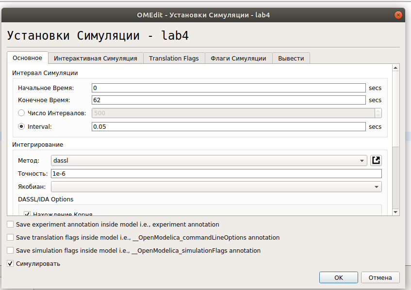{#fig:001 width=70%}

## Колебания гармонического осциллятора без затуханий и без действий внешней силы

$$
\ddot x + 10x = 0
$$ 

## Колебания гармонического осциллятора без затуханий и без действий внешней силы

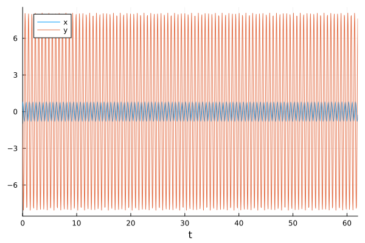{#fig:002 width=70%}

## Колебания гармонического осциллятора без затуханий и без действий внешней силы

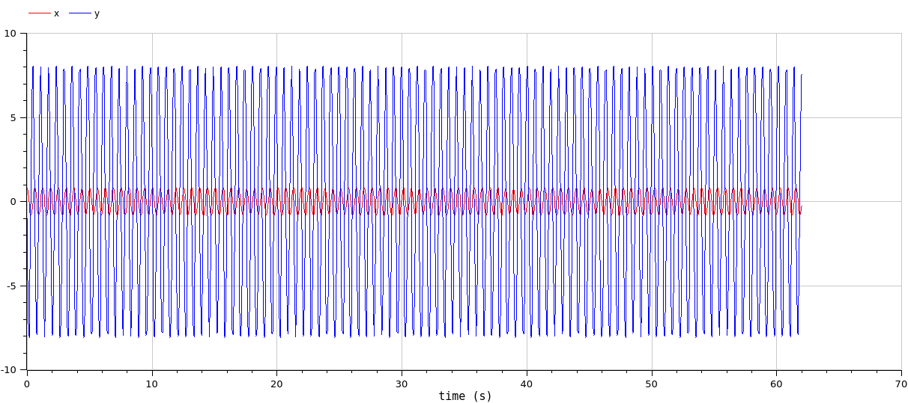{#fig:003 width=70%}

## Колебания гармонического осциллятора без затуханий и без действий внешней силы

{#fig:004 width=70%}

## Колебания гармонического осциллятора без затуханий и без действий внешней силы

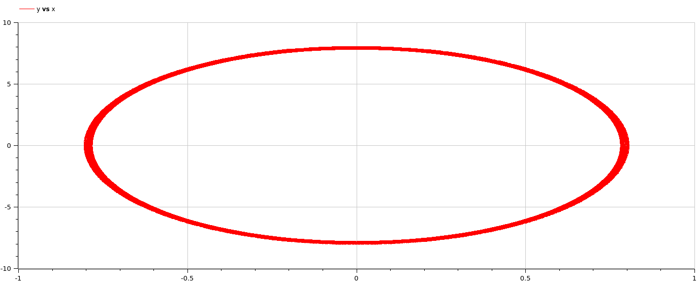{#fig:005 width=70%}

## Колебания гармонического осциллятора c затуханием и без действий внешней силы 

$$\ddot x + 1.5\dot x + 3x = 0$$

## Колебания гармонического осциллятора c затуханием и без действий внешней силы 

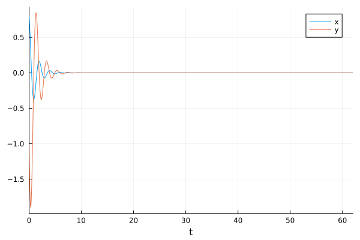{#fig:004 width=70%}

## Колебания гармонического осциллятора c затуханием и без действий внешней силы 

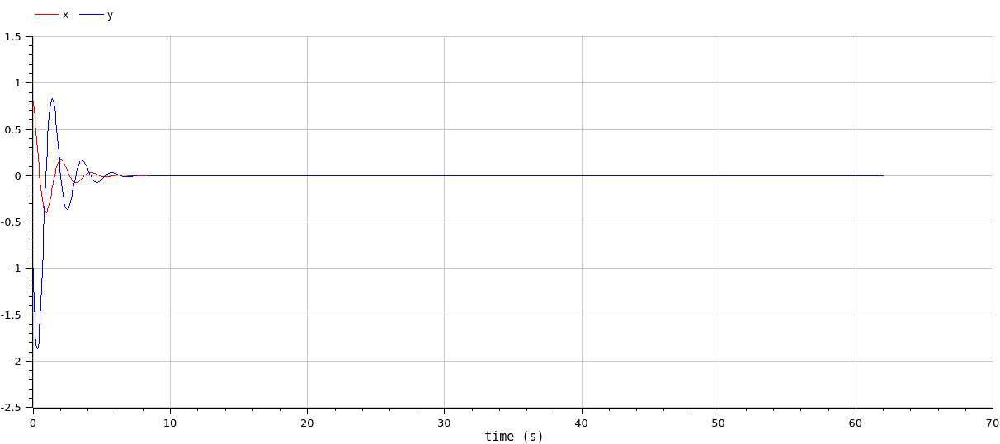{#fig:005 width=70%}

## Колебания гармонического осциллятора c затуханием и без действий внешней силы 

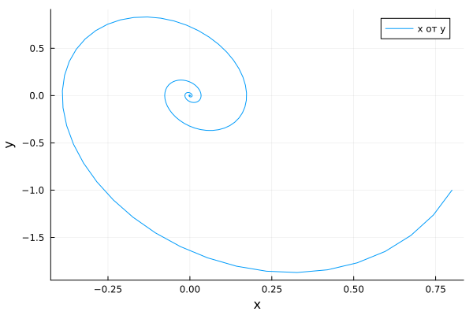{#fig:008 width=70%}

## Колебания гармонического осциллятора c затуханием и без действием внешней силы 

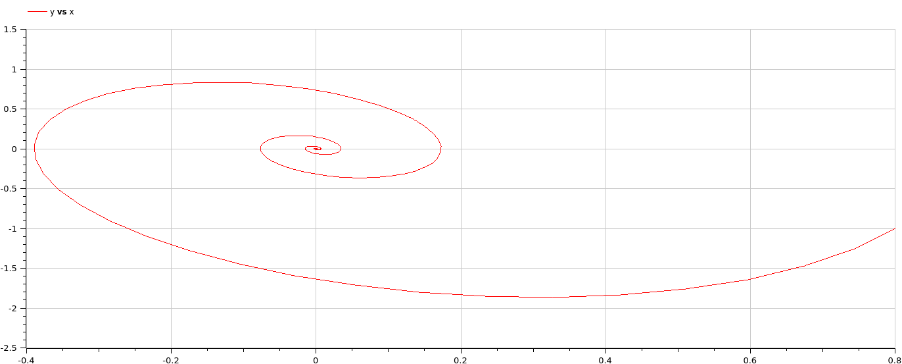{#fig:009 width=70%}

## Колебания гармонического осциллятора c затуханием и под действием внешней силы 

$$\ddot x + 0.6\dot x + x = cos(1.5t)$$

## Колебания гармонического осциллятора c затуханием и под действием внешней силы 

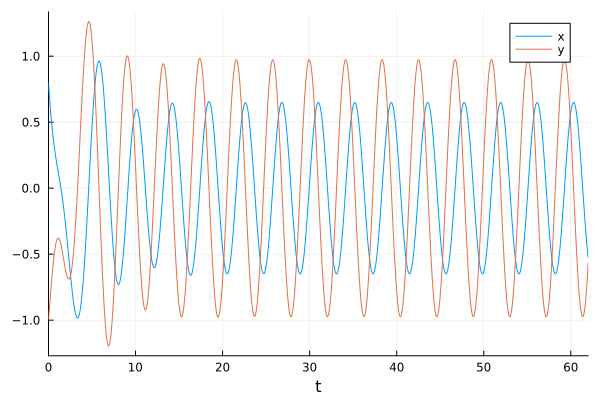{#fig:006 width=70%}

## Колебания гармонического осциллятора c затуханием и под действием внешней силы 

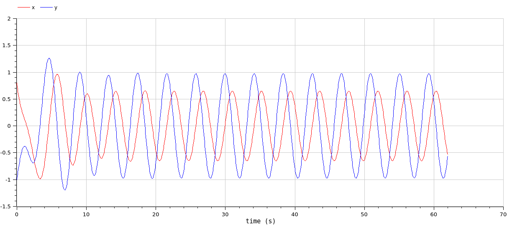{#fig:007 width=70%}

## Колебания гармонического осциллятора c затуханием и под действием внешней силы 

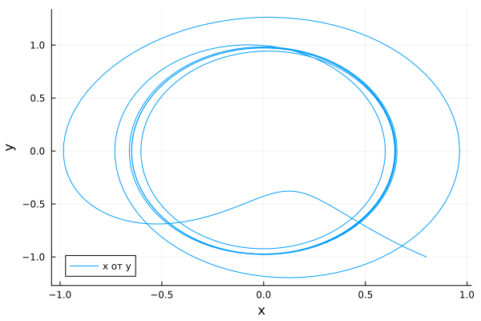{#fig:012 width=70%}

## Колебания гармонического осциллятора c затуханием и под действием внешней силы 

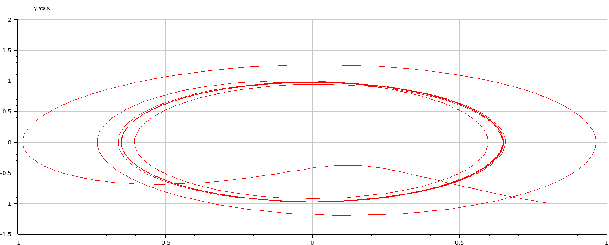{#fig:013 width=70%}

# Выводы

Построили математическую модель гармонического осциллятора и провели анализ.

# Список литературы

1. Simple harmonic motion [Электронный ресурс]. Wikimedia Foundation, Inc., 2024. URL: https://en.wikipedia.org/wiki/Simple_harmonic_motion.
2. Ландсберга Г.С. Элементарный учебник физики: Учеб. пособие В 3 т. Т. 3. Колебания и волны. Оптика. Атомная и ядерная физика. М.: ФИЗМАТЛИТ, 2009. 664 с.
3. Harmonic oscillator [Электронный ресурс]. Wikimedia Foundation, Inc., 2024. URL: https://en.wikipedia.org/wiki/Harmonic_oscillator.
