---
## Front matter
title: "Лабораторная работа №4"
subtitle: "Модель гармонических колебаний"
author: "Алади Принц Чисом"

## Generic otions
lang: ru-RU
toc-title: "Содержание"

## Bibliography
bibliography: bib/cite.bib
csl: pandoc/csl/gost-r-7-0-5-2008-numeric.csl

## Pdf output format
toc: true # Table of contents
toc-depth: 2
lof: true # List of figures
lot: false # List of tables
fontsize: 12pt
linestretch: 1.5
papersize: a4
documentclass: scrreprt
## I18n polyglossia
polyglossia-lang:
  name: russian
  options:
	- spelling=modern
	- babelshorthands=true
polyglossia-otherlangs:
  name: english
## I18n babel
babel-lang: russian
babel-otherlangs: english
## Fonts
mainfont: PT Serif
romanfont: PT Serif
sansfont: PT Sans
monofont: PT Mono
mainfontoptions: Ligatures=TeX
romanfontoptions: Ligatures=TeX
sansfontoptions: Ligatures=TeX,Scale=MatchLowercase
monofontoptions: Scale=MatchLowercase,Scale=0.9
## Biblatex
biblatex: true
biblio-style: "gost-numeric"
biblatexoptions:
  - parentracker=true
  - backend=biber
  - hyperref=auto
  - language=auto
  - autolang=other*
  - citestyle=gost-numeric
## Pandoc-crossref LaTeX customization
figureTitle: "Рис."
tableTitle: "Таблица"
listingTitle: "Листинг"
lofTitle: "Список иллюстраций"
lotTitle: "Список таблиц"
lolTitle: "Листинги"
## Misc options
indent: true
header-includes:
  - \usepackage{indentfirst}
  - \usepackage{float} # keep figures where there are in the text
  - \floatplacement{figure}{H} # keep figures where there are in the text
---

# Цель работы

Исследовать математическую модель гармонического осциллятора.

# Задание

Постройте фазовый портрет гармонического осциллятора и решение уравнения гармонического осциллятора для следующих случаев

1. Колебания гармонического осциллятора без затуханий и без действий внешней силы $\ddot x + 10x = 0$
2. Колебания гармонического осциллятора c затуханием и без действий внешней силы $\ddot x + 1.5\dot x + 3x = 0$
3. Колебания гармонического осциллятора c затуханием и под действием внешней силы $\ddot x + 0.6\dot x + x = cos(1.5t)$

На интервале $t \in [0; 62]$ (шаг 0.5) с начальными условиями $x_0 = 0.8, \, y_0=-1$ 

# Теоретическое введение

Гармони́ческие колеба́ния — колебания, при которых физическая величина изменяется с течением времени по гармоническому (синусоидальному, косинусоидальному) закону. [@wiki:bash].

Гармоническое колебание является специальным, частным видом периодического колебания. Периодическим называется повторяющееся движение, у которого каждый цикл в точности воспроизводит любой другой цикл. Этот специальный вид колебания очень важен, так как он чрезвычайно часто встречается в самых различных колебательных системах. Колебание груза на пружине, камертона, маятника, зажатой металлической пластинки как раз и является по своей форме гармоническим. Следует заметить, что при больших амплитудах колебания указанных систем имеют несколько более сложную форму, но они тем ближе к гармоническому, чем меньше амплитуда колебаний[@landsberg:bash]. 

Гармони́ческий осцилля́тор (в классической механике) — система, которая при выведении её из положения равновесия испытывает действие возвращающей силы F, пропорциональной смещению $x$[@wiki:osc:bash]:
$$
F = -kx,
$$

где $k$ — постоянный коэффициент.

Если $F$ — единственная сила, действующая на систему, то систему называют простым или консервативным гармоническим осциллятором. Свободные колебания такой системы представляют собой периодическое движение около положения равновесия (гармонические колебания). Частота и амплитуда при этом постоянны, причём частота не зависит от амплитуды.

Если имеется ещё и сила трения (затухание), пропорциональная скорости движения (вязкое трение), то такую систему называют затухающим или диссипативным осциллятором. Если трение не слишком велико, то система совершает почти периодическое движение — синусоидальные колебания с постоянной частотой и экспоненциально убывающей амплитудой. Частота свободных колебаний затухающего осциллятора оказывается несколько ниже, чем у аналогичного осциллятора без трения. 

Уравнение свободных колебаний гармонического осциллятора имеет следующий вид:

$$
\ddot x + 2\gamma\dot x + \omega _0^2x = 0, \tag{1}
$$

где $x$ – переменная, описывающая состояние системы (смещение грузика, заряд конденсатора и т.д.), $\gamma$ -- параметр, характеризующий потери энергии (трение в механической системе, сопротивление в контуре), $\omega _0$ – собственная частота колебаний, $t$ – время. (Обозначения $\ddot x = \dfrac{\partial^2x}{\partial t^2}$, $\dot x = \dfrac{\partial x}{\partial t}$) 

Уравнение (1) есть линейное однородное дифференциальное уравнение второго порядка и оно является примером линейной динамической системы.
При отсутствии потерь в системе ($\gamma = 0$) вместо уравнения (1) получаем уравнение консервативного осциллятора энергия колебания которого сохраняется во времени:

$$
\ddot x + \omega _0 ^2 = 0. \tag{2}
$$

Для однозначной разрешимости уравнения второго порядка (2) необходимо задать два начальных условия вида

$$
\begin{cases}
 x(t_0) = x_0, \\ \tag{3}
 \dot x(t_0) = y_0.
\end{cases}
$$

где $x(y)$ – численности войск первой (второй) стороны в момент времени $t$; $a_x$ ($a_y$) – эффективность огня первой (второй) стороны (число поражаемых целей противника в единицу времени)1; p и q – параметры степени.
В начальный момент времени заданы численности сторон: $x(0) = x_0$ и $y(0) = y_0$.

Уравнение второго порядка (2) можно представить в виде системы двух уравнений первого порядка:

$$
\begin{cases}
  \dot x = y, \\ \tag{4}
  \dot y = -\omega _0 ^2 x
\end{cases}
$$

Начальные условия (3) для системы (4) примут вид:

$$
\begin{cases}
 x(t_0) = x_0, \\ \tag{5}
 y(t_0) = y_0.
\end{cases}
$$

Независимые переменные $x$, $y$ определяют пространство, в котором «движется» решение. Это фазовое пространство системы, поскольку оно двумерно будем называть его фазовой плоскостью.

Значение фазовых координат $x$, $y$ в любой момент времени полностью определяет состояние системы. Решению уравнения движения как функции времени отвечает гладкая кривая в фазовой плоскости. Она называется фазовой траекторией. Если множество различных решений (соответствующих различным начальным условиям) изобразить на одной фазовой плоскости, возникает общая картина поведения системы. Такую картину, образованную набором фазовых траекторий, называют фазовым портретом

# Выполнение лабораторной работы

## Программная реализация модели линейного гормонического осциллятора

Зададим функцию для решения модели линейного гормонического осциллятора. Возьмем интервал $t \in [0; 62]$ (шаг 0.5) с начальными условиями $x_0 = 0.8, \, y_0=-1$ . Зададим функции для случаев однородного уравнения и неоднородного отдельно. В Julia можно решить сразу уравнение второго порядка:

```julia

//Начальные условия и параметры

tspan = (0,62)

p1 = [0,10]
p2 = [1.5,3.0]
p3 = [0.6,1.0]

du0 = [-1.0]
u0 = [0.8]

//без действий внешний силы

function harm_osc_2ord(ddu, du, u, p, t)
	g, w = p
	ddu .= -g.*du.-w^2 .*u
end

//внешняя сила
f(t) = cos(1.5*t)

//с действием в нешней силы
function forced_harm_osc_2ord(ddu, du, u, p, t)
	g, w = p 
	ddu .= -g.*du.-w^2 .*u .+ cos(1.5*t)
end
```

Для задания проблемы используется функция `SecondOrderODEProblem`, а для решения -- численный метод DPRKN6():

```julia
prob1 = SecondOrderODEProblem(harm_osc_2ord, du0, u0, tspan, p1)
sol1 = solve(prob1, DPRKN6(), saveat=0.05)
prob2 = SecondOrderODEProblem(harm_osc_2ord, du0, u0, tspan, p2)
sol2 = solve(prob2, DPRKN6(), saveat=0.05)
prob3 = SecondOrderODEProblem(forced_harm_osc_2ord, du0, u0, tspan, p3)
sol3 = solve(prob3, Tsit5(), saveat=0.05)
```

Ниже приведены те же самые действия, но для модели в виде системы ОДУ первого порядка, используется численный метод Tsit5():

```julia
//без действий внешний силы

function harm_osc(du,u,p,t)
	g,w = p
	du[1] = u[2]
	du[2] = -w^2 .* u[1] - g.*u[2]
end

//внешняя сила
f(t) = cos(1.5*t)

//с действием в нешней силы
function forced_harm_osc(du,u,p,t)
	g,w = p
	du[1] = u[2]
	du[2] = -w^2 .* u[1] - g.*u[2] .+f(t)
end

problem1 = ODEProblem(harm_osc, [0.8, -1], tspan, p1)
solution1 = solve(problem1, Tsit5(),saveat=0.05)
problem2 = ODEProblem(harm_osc, [0.8, -1], tspan, p2)
solution2 = solve(problem2, Tsit5(),saveat=0.05)
problem3 = ODEProblem(forced_harm_osc, [0.8, -1], tspan, p3)
solution3 = solve(problem3, Tsit5(),saveat=0.05)
```

Также зададим эту модель в OpenModelica. Модель для колебания без затухания и без действия внешних сил:

```
model lab4

Real x(start=0.8);
Real y(start=-1);

parameter Real w=10;
parameter Real g=0;

Real p;

equation

der(x) = y;
der(y) = -w^2*x-g*y;

end lab4;
```

Модель для колебания с затуханием и без действия внешних сил:

```
model lab4

Real x(start=0.8);
Real y(start=-1);

parameter Real w=3.0;
parameter Real g=1.5;

Real p;

equation

der(x) = y;
der(y) = -w^2*x-g*y;

end lab4;
```

Модель для колебания с затуханием и действием внешних сил:

```
model lab4

Real x(start=0.8);
Real y(start=-1);

parameter Real w=1.0;
parameter Real g=0.6;
Real p;

equation

der(x) = y;
der(y) = -w^2*x-g*y+p;
p = cos(1.5*time);

end lab4;
```

Начальные условия зададим в настройках моделирования:

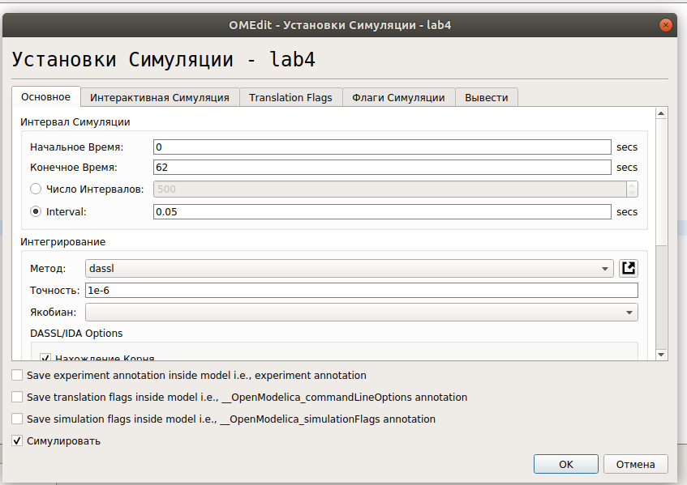{#fig:001 width=70%}

## Колебания гармонического осциллятора без затуханий и без действий внешней силы

Рассмотрим колебания гармонического осциллятора без затуханий и без действий внешней силы, заданные уравнением:

$$
\ddot x + 10x = 0
$$ 

Графики решений, полученные с помощью OpenModelica и Julia идентичны(рис. @fig:002,  @fig:003):

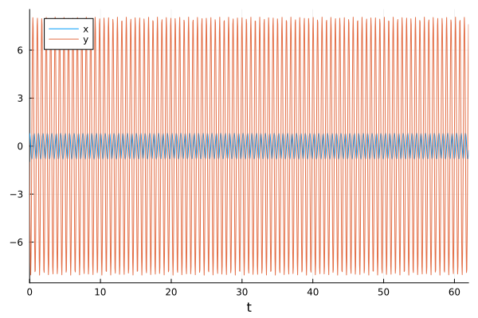{#fig:002 width=70%}

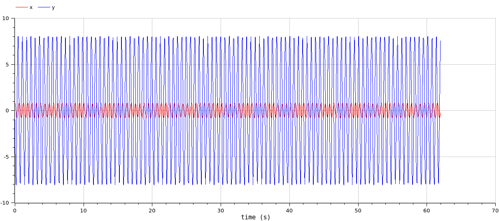{#fig:003 width=70%}

Графики решений, полученные с помощью OpenModelica и Julia также идентичны(рис. @fig:004,  @fig:005):

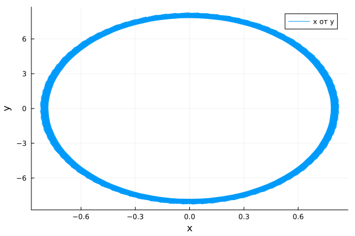{#fig:004 width=70%}

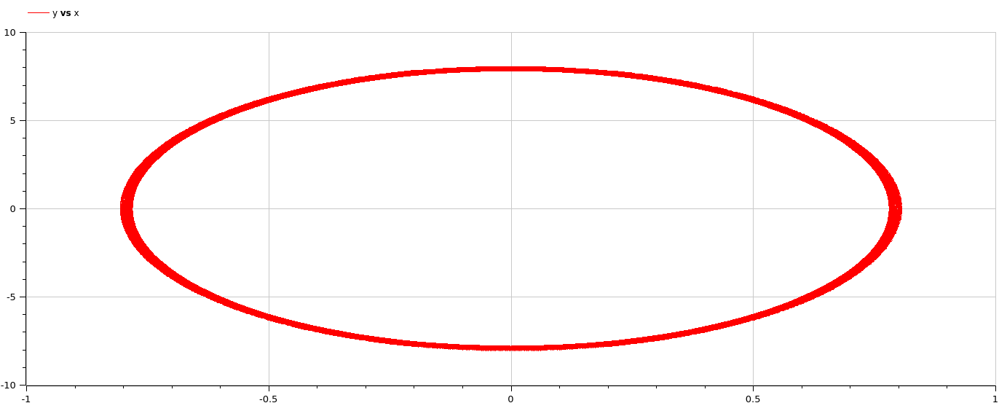{#fig:005 width=70%}

Можно видеть, что колебание осциллятора периодично, график не задухает.

## Колебания гармонического осциллятора c затуханием и без действий внешней силы 

Рассмотрим колебания гармонического осциллятора c затуханием и без действий внешней силы, заданные уравнением:

$$\ddot x + 1.5\dot x + 3x = 0$$

Графики, полученные с помощью OpenModelica и Julia идентичны(рис. @fig:004,  @fig:005):

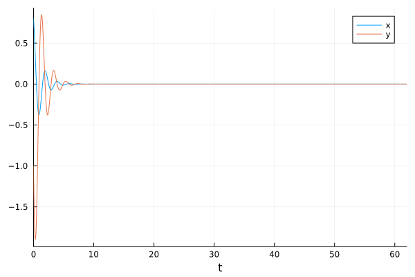{#fig:006 width=70%}

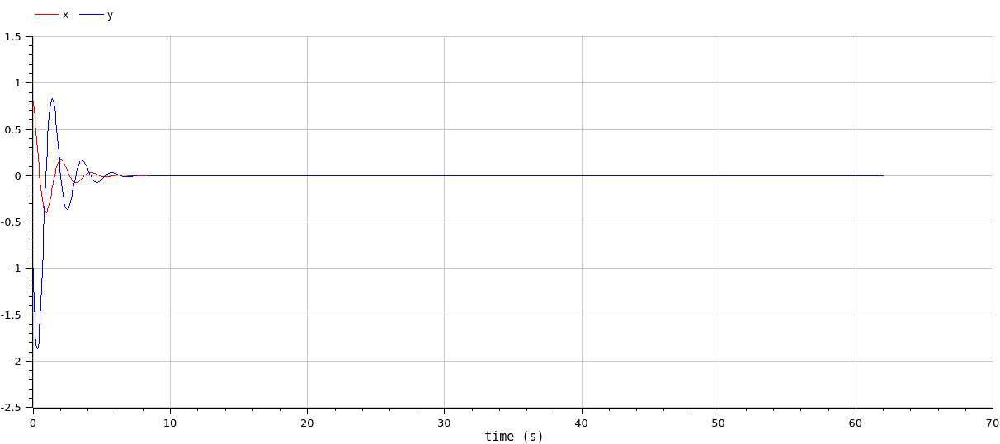{#fig:007 width=70%}

Графики решений, полученные с помощью OpenModelica и Julia также идентичны(рис. @fig:008,  @fig:009):

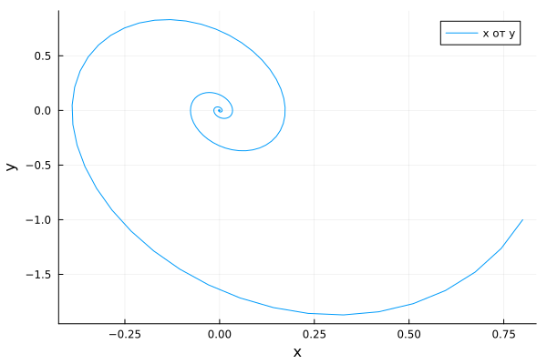{#fig:008 width=70%}

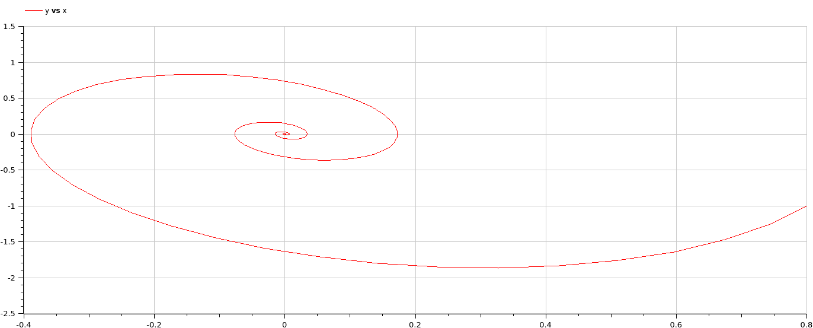{#fig:009 width=70%}

Можно видеть, что снчала происходят колебания осциллятора, а затем график затухает.

## Колебания гармонического осциллятора c затуханием и под действием внешней силы 

Рассмотрим колебания гармонического осциллятора c затуханием и под действием внешней силы, заданные уравнением:

$$\ddot x + 0.6\dot x + x = cos(1.5t)$$

Графики, полученные с помощью OpenModelica и Julia идентичны(рис. @fig:010,  @fig:0011):

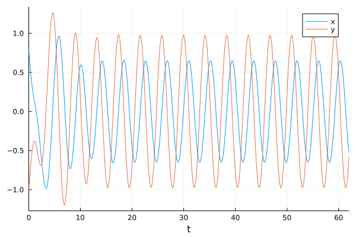{#fig:010 width=70%}

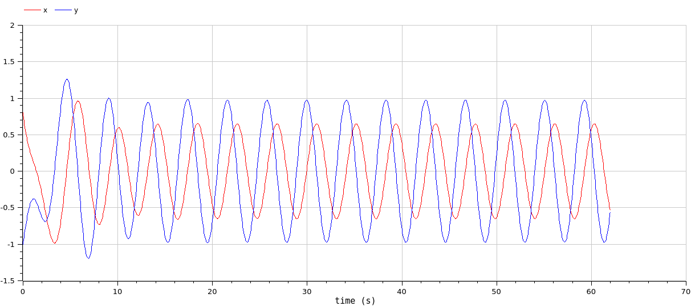{#fig:011 width=70%}

Графики решений, полученные с помощью OpenModelica и Julia также идентичны(рис. @fig:012,  @fig:013):

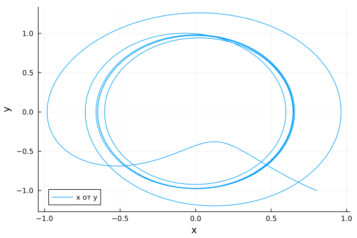{#fig:012 width=70%}

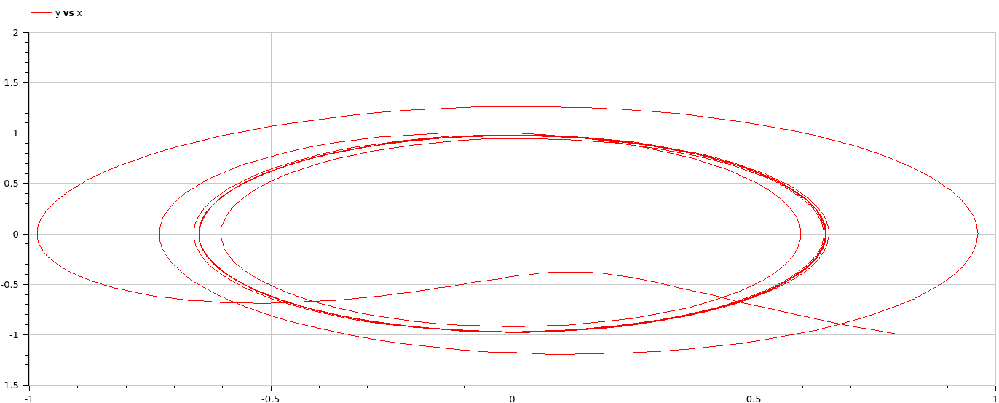{#fig:013 width=70%}

Можно увидеть, что система приходит в состояние равновесия, период колебаний больше, чем в первом случае, так как затухание замедляет его.

# Выводы

Построили математическую модель гармонического осциллятора и провели анализ.

# Список литературы{.unnumbered}

::: {#refs}
:::
