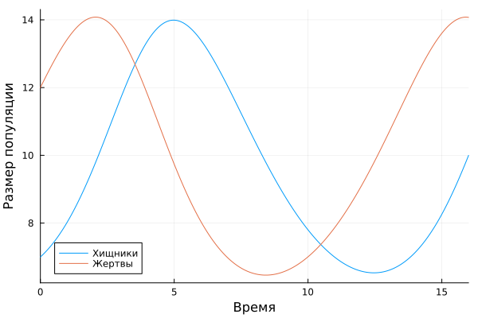
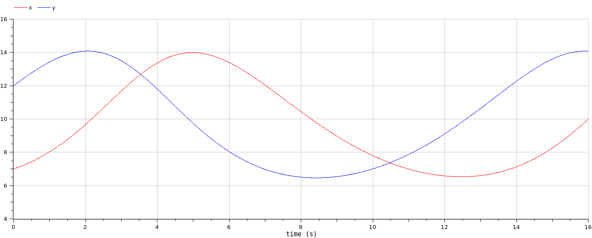
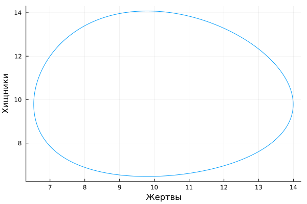
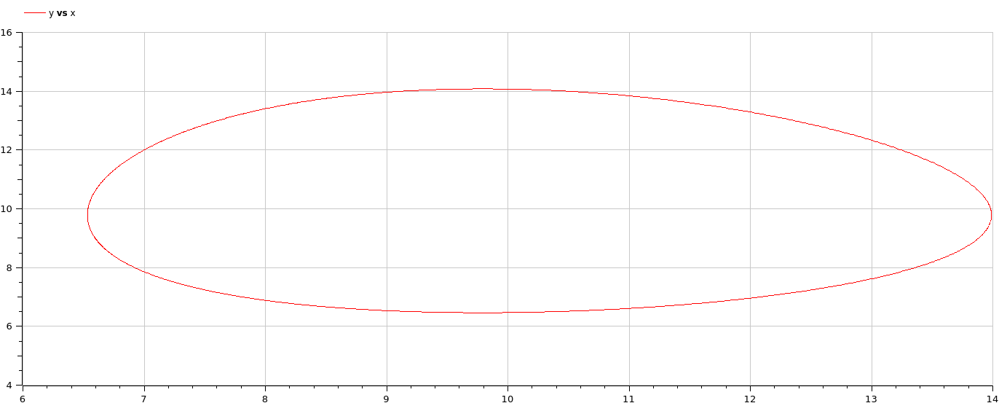
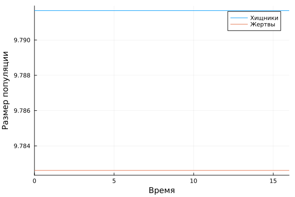
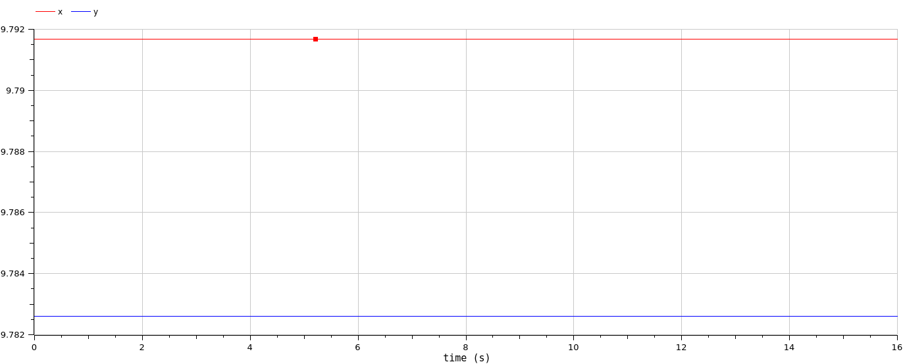
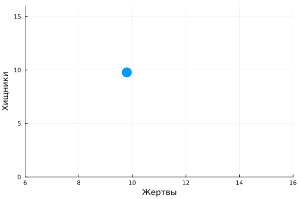
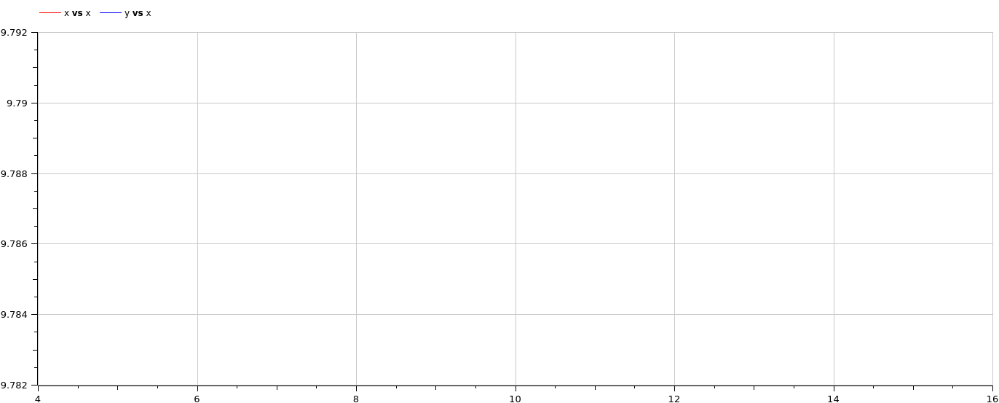

---
## Front matter
lang: ru-RU
title: Лабораторная работа №5
subtitle: Модель хищник-жертва
author:
 - Алади П. Ч.
institute:
 - Российский университет дружбы народов, Москва, Россия


## i18n babel
babel-lang: russian
babel-otherlangs: english

## Formatting pdf
toc: false
toc-title: Содержание
slide_level: 2
aspectratio: 169
section-titles: true
theme: metropolis
header-includes:
 - \metroset{progressbar=frametitle,sectionpage=progressbar,numbering=fraction}
 - '\makeatletter'
 - '\beamer@ignorenonframefalse'
 - '\makeatother'
---

# Информация

## Докладчик

:::::::::::::: {.columns align=center}
::: {.column width="70%"}

  * Алади Принц Чисом
  * студентк группы Нфибд-01-22
  * Российский университет дружбы народов
  * <https://github.com/pjosh456>


:::
::: {.column width="30%"}

:::
::::::::::::::

# Вводная часть

## Цели 

Исследовать математическую модель хищник-жертва.

## Задачи

Для модели «хищник-жертва»:

$$\begin{cases}
\dfrac{dx}{dt} = -0.45 x(t)+0.046 x(t)y(t)\\
\dfrac{dy}{dt} = 0.47y(t)- 0.048 x(t)y(t)
\end{cases}$$

Постройте график зависимости численности хищников от численности жертв, а также графики изменения численности хищников и численности жертв при следующих начальных условиях: $x_0 = 7$, $y_0 = 12$. Найдите стационарное состояние системы. 

## Материалы и методы

- Язык программирования `Julia` 
- Библиотеки
	- `OrdinaryDiffEq`
	- `Plots`
- Язык программирования `OpenModelica` 

# Выполнение лабораторной работы

## Теоретическое введение

$$\begin{cases}
  &\dfrac{dx}{dt} = ax(t)-bx(t)y(t)\\
  &\dfrac{dy}{dt} = -cy(t)+dx(t)y(t)
\end{cases}$$

$x$ – число жертв, $y$ - число хищников
$a$, $d$ - коэффициенты прироста популяции, $b$, $c$ - коэффициенты смертностик.

## Теоретическое введение

$$\begin{cases}
  -0.45 x(t)+0.046 x(t)y(t) = 0\\
  0.47y(t)- 0.048 x(t)y(t) = 0
\end{cases}$$

$$\begin{cases}
  x_0 = 0.47/0.048 = 9.79167\\
  y_0 = 0.45/0.046 = 9.78261
\end{cases}$$

##  Julia. Программная реализация модели хищник-жертва

```julia
	function lotka_volterra(u, p, t)
	    # Model parameters.
	    a, b, c, d = p
	    # Current state.
	    x, y = u
	
	    # Evaluate differential equations.
	    dx = (a - b * y) * x
	    dy = (c * x - d) * y 
	
	    return [dx, dy]
	end
	
	# initial-value problem.
```

## Julia. Программная реализация модели хищник-жертва

```julia
u0 = [7.0, 12.0]
p = [0.45, 0.046, 0.47,0.048]
tspan = (0.0, 16.0)
```

Для отрисовки стационарного состояния задаём:

```julia
u0 = [0.47/0.048, 0.45/0.046]
```

## Julia. Программная реализация модели хищник-жертва

```julia
prob = ODEProblem(lotka_volterra, u0, tspan, p)
dt = 0.01
solution = solve(prob, Tsit5(); saveat = dt)
```

## OpenModelica. Программная реализация модели хищник-жертва

```
parameter Real a=0.45;
parameter Real b=0.046;
parameter Real c=0.47;
parameter Real d=0.048;

parameter Real x0=7;
parameter Real y0=12;

Real x(start=x0);
Real y(start=y0);
```

## OpenModelica. Программная реализация модели хищник-жертва

```
equation

der(x) = -a*x + b*x*y;
der(y) = c*y-d*x*y;
```

Для отрисовки стационарного состояния задаём:

```
parameter Real x0=0.47/0.048;
parameter Real y0=0.45/0.046;
```

## Графики

{#fig:001 width=70%}

## Графики

{#fig:002 width=70%}

## Графики

{#fig:003 width=70%}

## Графики

{#fig:004 width=70%}

## Графики

{#fig:005 width=70%}

## Графики

{#fig:006 width=70%}

## Графики

{#fig:007 width=70%}

## Графики

{#fig:008 width=70%}

# Выводы

Построили математическую модель хищник жертва и провели анализ.

# Список литературы

1. Вольтерра В. Математическая теория борьбы за существование. Наука, 1976. 354 с.
