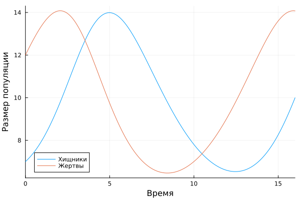
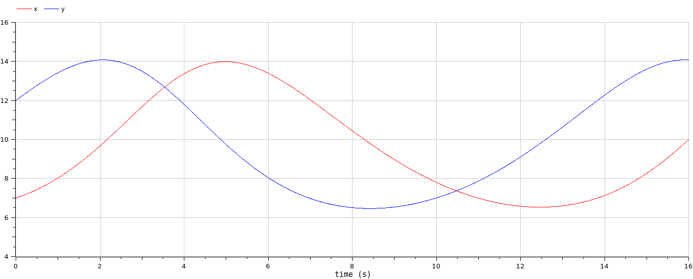
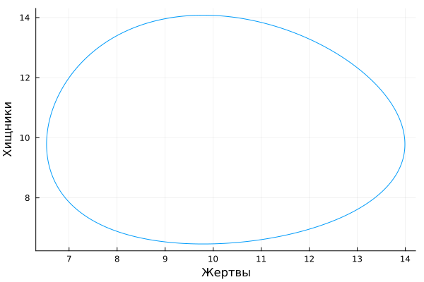
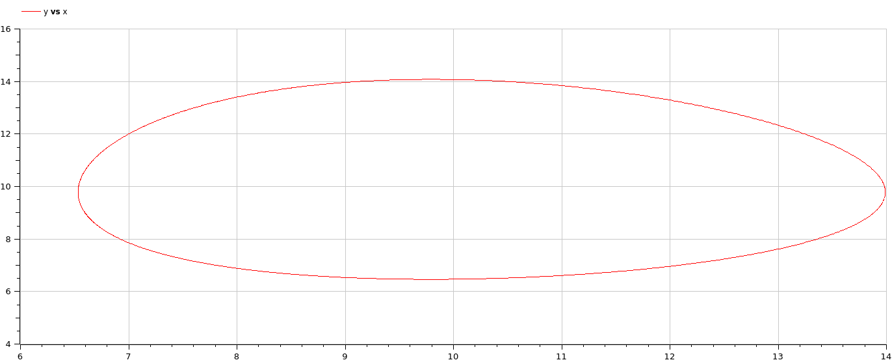
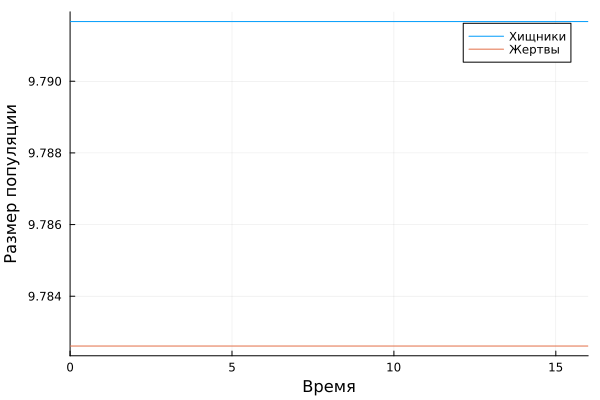
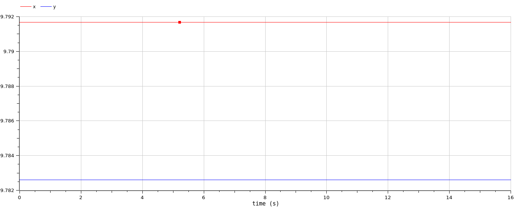
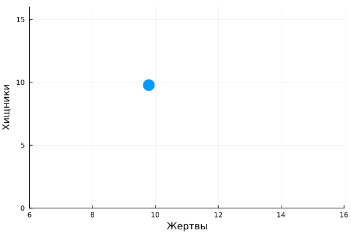
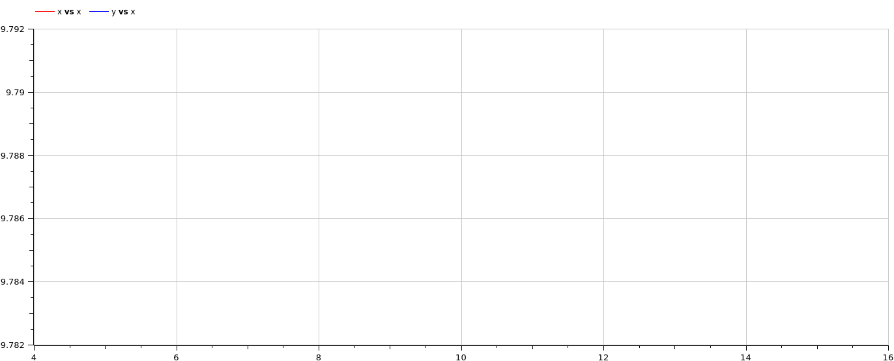

---
## Front matter
title: "Лабораторная работа №5"
subtitle: "Модель хищник-жертва"
author: "Алади Принц Чисом"

## Generic otions
lang: ru-RU
toc-title: "Содержание"

## Bibliography
bibliography: bib/cite.bib
csl: pandoc/csl/gost-r-7-0-5-2008-numeric.csl

## Pdf output format
toc: true # Table of contents
toc-depth: 2
lof: true # List of figures
lot: false # List of tables
fontsize: 12pt
linestretch: 1.5
papersize: a4
documentclass: scrreprt
## I18n polyglossia
polyglossia-lang:
  name: russian
  options:
	- spelling=modern
	- babelshorthands=true
polyglossia-otherlangs:
  name: english
## I18n babel
babel-lang: russian
babel-otherlangs: english
## Fonts
mainfont: PT Serif
romanfont: PT Serif
sansfont: PT Sans
monofont: PT Mono
mainfontoptions: Ligatures=TeX
romanfontoptions: Ligatures=TeX
sansfontoptions: Ligatures=TeX,Scale=MatchLowercase
monofontoptions: Scale=MatchLowercase,Scale=0.9
## Biblatex
biblatex: true
biblio-style: "gost-numeric"
biblatexoptions:
  - parentracker=true
  - backend=biber
  - hyperref=auto
  - language=auto
  - autolang=other*
  - citestyle=gost-numeric
## Pandoc-crossref LaTeX customization
figureTitle: "Рис."
tableTitle: "Таблица"
listingTitle: "Листинг"
lofTitle: "Список иллюстраций"
lotTitle: "Список таблиц"
lolTitle: "Листинги"
## Misc options
indent: true
header-includes:
  - \usepackage{indentfirst}
  - \usepackage{float} # keep figures where there are in the text
  - \floatplacement{figure}{H} # keep figures where there are in the text
---

# Цель работы

Исследовать математическую модель хищник-жертва.

# Задание

Для модели «хищник-жертва»:

$$\begin{cases}
\dfrac{dx}{dt} = -0.45 x(t)+0.046 x(t)y(t)\\
\dfrac{dy}{dt} = 0.47y(t)- 0.048 x(t)y(t)
\end{cases}$$

Постройте график зависимости численности хищников от численности жертв, а также графики изменения численности хищников и численности жертв при следующих начальных условиях: $x_0 = 7$, $y_0 = 12$. Найдите стационарное состояние системы.

# Теоретическое введение

Модель "Хищник-жертва" основывается на следующих предположениях [@Volterra:bash]:

1. Численность популяции жертв $x$ и хищников $y$ зависят только от времени (модель не учитывает пространственное распределение популяции на занимаемой территории)

2. В отсутствии взаимодействия численность видов изменяется по модели Мальтуса (экспоненциальный рост с постоянным темпом), при этом число жертв увеличивается, а число хищников падает

3. Естественная смертность жертвы и естественная рождаемость хищника считаются несущественными

4. Эффект насыщения численности обеих популяций не учитывается

5. Скорость роста численности жертв уменьшается пропорционально численности хищников

$$\begin{cases}
  &\dfrac{dx}{dt} = ax(t)-bx(t)y(t)\\
  &\dfrac{dy}{dt} = -cy(t)+dx(t)y(t)
\end{cases}$$

В этой модели $x$ – число жертв, $y$ - число хищников. Коэффициент $a$ описывает скорость естественного прироста числа жертв в отсутствие хищников, $c$ - естественное вымирание хищников, лишенных пищи в виде жертв. Вероятность взаимодействия жертвы и хищника считается пропорциональной как количеству жертв, так и числу самих хищников. Каждый акт взаимодействия уменьшает популяцию жертв, но способствует увеличению популяции хищников (члены $-bxy$ и $dxy$ в правой части уравнения).  

Найдём стационарное состояние системы. Для этого приравняем её правые части к нулю.

$$\begin{cases}
  ax(t)-bx(t)y(t) = 0\\
  -cy(t)+dx(t)y(t) = 0
\end{cases}$$

Из полученной системы получаем, что стационарное состояние системы будет в точке $x_0 = c/d$, $y_0 = a/b$. Если начальные значения задать в стационарном состоянии $x(0) = x_0$, $y(0) = y_0$, то в любой момент времени численность популяций изменяться не будет. При малом отклонении от положения равновесия численности как хищника, так и жертвы с течением времени не возвращаются к равновесным значениям, а совершают периодические колебания вокруг стационарной точки.

# Выполнение лабораторной работы

## Поиск стационарного состояния системы

Найдём стационарное состояние системы. Для этого приравняем её правые части к нулю.

$$\begin{cases}
  -0.45 x(t)+0.046 x(t)y(t) = 0\\
  0.47y(t)- 0.048 x(t)y(t) = 0
\end{cases}$$

Из полученной системы получаем, что стационарное состояние системы будет в точке $x_0 = 0.47/0.048 = 9.79167$, $y_0 = 0.45/0.046 = 9.78261$. Если начальные значения задать в стационарном состоянии $x(0) = x_0$, $y(0) = y_0$, то в любой момент времени численность популяций изменяться не будет. При малом отклонении от положения равновесия численности как хищника, так и жертвы с течением времени не возвращаются к равновесным значениям, а совершают периодические колебания вокруг стационарной точки.

## Программная реализация модели хищник-жертва

Зададим функцию для решения модели хищник-жертва. Возьмем интервал $t \in [0; 16]$ (шаг 0.01) с начальными условиями $x_0 = 7, \, y_0=12$.  

```julia
	function lotka_volterra(u, p, t)
	    # Model parameters.
	    a, b, c, d = p
	    # Current state.
	    x, y = u
	
	    # Evaluate differential equations.
	    dx = (a - b * y) * x
	    dy = (c * x - d) * y 
	
	    return [dx, dy]
	end
	
	# initial-value problem.
  u0 = [7.0, 12.0]
	p = [0.45, 0.046, 0.47,0.048]
	tspan = (0.0, 16.0)
```

Для отрисовки стационарного состояния задаём:

```julia
u0 = [0.47/0.048, 0.45/0.046]
```

Для задания проблемы используется функция `ODEProblem`, а для решения -- численный метод `Tsit5()`:

```julia
prob = ODEProblem(lotka_volterra, u0, tspan, p)
dt = 0.01
solution = solve(prob, Tsit5(); saveat = dt)
```

Также зададим эту модель в OpenModelica. Модель для колебания без затухания и без действия внешних сил:

```
model lab5


parameter Real a=0.45;
parameter Real b=0.046;
parameter Real c=0.47;
parameter Real d=0.048;

parameter Real x0=7;
parameter Real y0=12;

Real x(start=x0);
Real y(start=y0);

equation

der(x) = -a*x + b*x*y;
der(y) = c*y-d*x*y;

end lab5;
```

Для отрисовки стационарного состояния меняем значения параметров:

```
parameter Real x0=0.47/0.048;
parameter Real y0=0.45/0.046;
```

## Графики

Графики решений, полученные с помощью OpenModelica и Julia идентичны для данных начальных условий(рис. @fig:001,  @fig:002):

{#fig:001 width=70%}

{#fig:002 width=70%}

Графики фазового портрета, полученные с помощью OpenModelica и Julia для данных начальных условий также идентичны(рис. @fig:003,  @fig:004):

{#fig:003 width=70%}

{#fig:004 width=70%}

Графики фазового портрета, полученные с помощью OpenModelica и Julia в стационарной точке также идентичны(рис. @fig:005,  @fig:006):

{#fig:005 width=70%}

{#fig:006 width=70%}

Графики фазового портрета, полученные с помощью OpenModelica и Julia в стационарной точке также идентичны(рис. @fig:007,  @fig:008):

{#fig:007 width=70%}

{#fig:008 width=70%}

Действительно, если начальное условие соответствует стационарной точке, то система находится в стационарном состоянии, то есть число хищников и жертв не изменяется.

# Выводы

Построили математическую модель хищник жертва и провели анализ.

# Список литературы{.unnumbered}

::: {#refs}
:::
