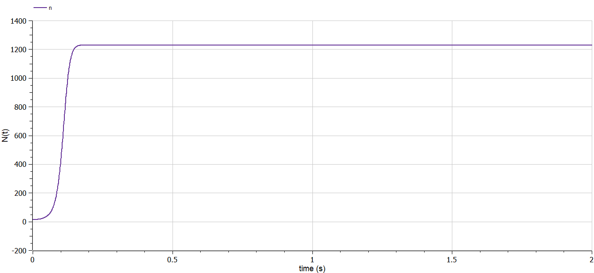

---
## Front matter
lang: ru-RU
title: Лабораторной работа №7
subtitle: Эффективность рекламы
author:
  - Алади П. Ч.
institute:
  - Российский университет дружбы народов, Москва, Россия

## i18n babel
babel-lang: russian
babel-otherlangs: english

## Formatting pdf
toc: false
toc-title: Содержание
slide_level: 2
aspectratio: 169
section-titles: true
theme: metropolis
header-includes:
 - \metroset{progressbar=frametitle,sectionpage=progressbar,numbering=fraction}
 - '\makeatletter'
 - '\beamer@ignorenonframefalse'
 - '\makeatother'
---

# Информация

## Докладчик

:::::::::::::: {.columns align=center}
::: {.column width="70%"}

  * Алади Принц Чисом
  * студент
  * Российский университет дружбы народов
  * [103225007@pfur.ru](mailto:1032225007@pfur.ru)
  * <https://pjosh456.github.io/>

:::
::: {.column width="25%"}

:::
::::::::::::::

# Введение

## Цель работы

Исследовать модель эффективности рекламы. 

## Задание

Построить график распространения рекламы, математическая модель которой описывается
следующим уравнением:

1. $\dfrac{dn}{dt} = (0.88+0.00008n(t))(N-n(t))$

2. $\dfrac{dn}{dt} = (0.00008+0.88n(t))(N-n(t))$

3. $\dfrac{dn}{dt} = (0.7t+0.6sin(t)n(t))(N-n(t))$

При этом объем аудитории $N = 1230$, в начальный момент о товаре знает 14 человек. Для случая 2 определить в какой момент времени скорость распространения рекламы будет
иметь максимальное значение.

# Выполнение лабораторной работы

## Реализация на Julia

```Julia
using DifferentialEquations, Plots;
f(n, p, t) = (p[1] + p[2]*n)*(p[3] - n)
p1 = [0.88, 0.00008, 1230]
p2 = [0.00008, 0.88, 1230]
n_0 = 14
tspan1 = (0.0, 14.0)
tspan2 = (0.0, 0.02)
prob1 = ODEProblem(f, n_0, tspan1, p1)
prob2 = ODEProblem(f, n_0, tspan2, p2)
```

## Реализация на Julia

```Julia
sol1 = solve(prob1, Tsit5(), saveat = 0.01)
plot(sol1, markersize =:15, c =:green, yaxis = "N(t)")
```

## Реализация на Julia

{#fig:001 width=70%}

## Реализация на Julia

```Julia
sol2 = solve(prob2, Tsit5(), saveat = 0.0001)
plot(sol2, markersize =:15, c=:green, yaxis="N(t)")
```

## Реализация на Julia

{#fig:002 width=70%}

## Реализация на Julia

```Julia
function f3(u,p,t)
    n = u
    dn = (0.7*t + 0.6*sin(t)*n)*(1230 - n)
end
u_0 = 14
tspan = (0.0, 2)
prob = ODEProblem(f3, u_0, tspan)
sol = DifferentialEquations.solve(prob, Tsit5(), saveat = 0.001)
plot(sol, markersize =:15, c=:green, yaxis="N(t)")
```

## Реализация на Julia

{#fig:003 width=70%}

## Реализация на OpenModelica

```
  parameter Real a_1 = 0.88;
  parameter Real a_2 = 0.00008;
  parameter Real N = 1230;
  parameter Real n_0 = 14;
  
  Real n(start=n_0);

equation
  der(n) = (a_1 + a_2*n)*(N - n);
```

## Реализация на OpenModelica

{#fig:004 width=70%}

## Реализация на OpenModelica

```
  parameter Real a_1 = 0.00008;
  parameter Real a_2 = 0.88;
  parameter Real N = 1230;
  parameter Real n_0 = 14;
  
  Real n(start=n_0);

equation
  der(n) = (a_1 + a_2*n)*(N - n);
```

## Реализация на OpenModelica

{#fig:005 width=70%}

## Реализация на OpenModelica

.png){#fig:006 width=70%}

## Реализация на OpenModelica

_2.png){#fig:007 width=70%}

## Реализация на OpenModelica

```
  parameter Real a_1 = 0.7;
  parameter Real a_2 = 0.6;
  parameter Real N = 1230;
  parameter Real n_0 = 14;
  
  Real n(start=n_0);

equation
  der(n) = (a_1*time + a_2*sin(time)*n)*(N - n);
```

## Реализация на OpenModelica

{#fig:008 width=70%}

# Выводы

В результате выполнения данной лабораторной работы была исследована модель эффективности рекламы.

## Список литературы

1. Исследование модели рекламной кампании [Электронный ресурс]. URL:https://studfile.net/preview/310591/.
